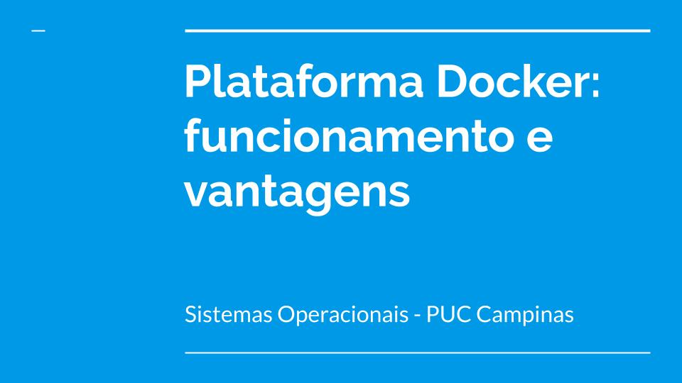

# Docker demo

Nessa demo vamos criar um servidor simples em python, 
construir uma imagem para a aplicação e criar um contêiner
baseado nessa imagem.

# Passos

```
docker build --tag docker-demo .

docker run --name docker-demo1 -p 5000:5000 docker-demo
```

# Apresentação


.jpg "Slide 2")
.jpg "Slide 3")
.jpg "Slide 4")
.jpg "Slide 5")
.jpg "Slide 6")
.jpg "Slide 7")
.jpg "Slide 8")
.jpg "Slide 9")
.jpg "Slide 10")
.jpg "Slide 11")
.jpg "Slide 12")
.jpg "Slide 13")
.jpg "Slide 14")
.jpg "Slide 15")
.jpg "Slide 16")
